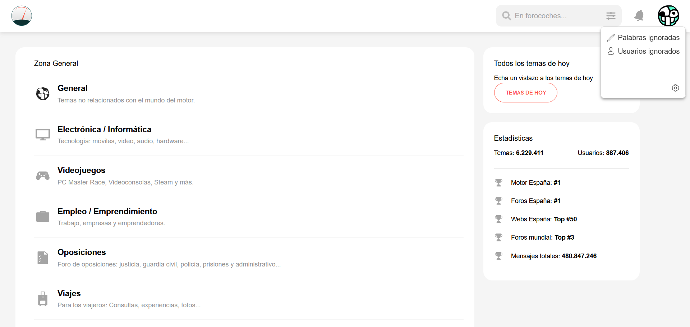
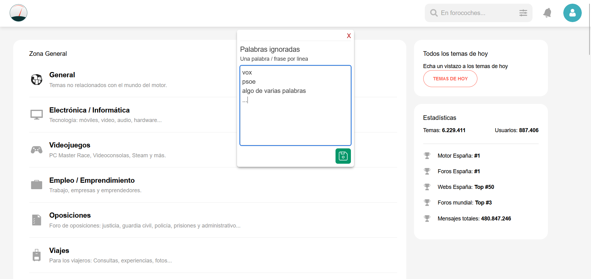
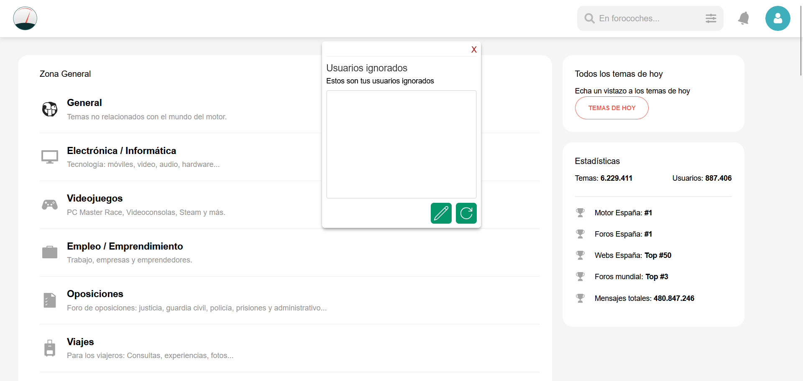
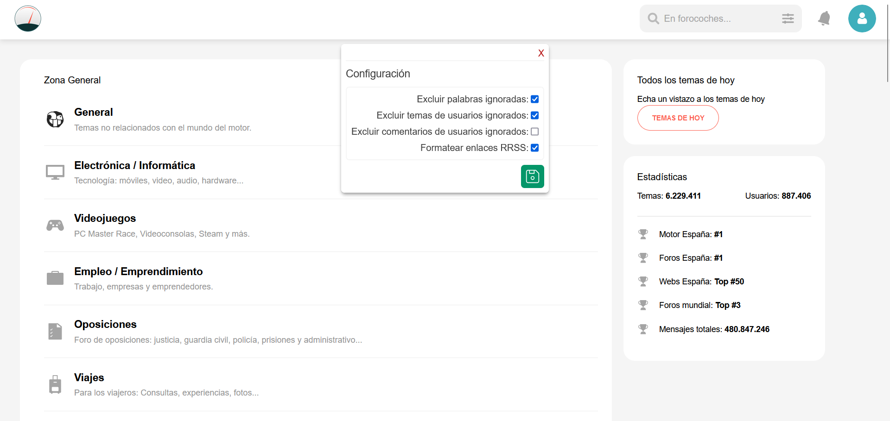

# FC-PLUS

Userscript que actua como extensión para forocoches.com.
Puedes instalarlo con tu extensión favorita, te recomiendo [ViolentMonkey](https://violentmonkey.github.io/)

## Como abrir el menu
Dejando el raton encima de tu foto de perfil (arriba a la derecha) aparecerá roto2, haciendo click se desplega el menu de la extensión.
Si no quieres esperar tambien puedes hacer ctrl+click en tu foto de perfil.

## Funciones

### Ignorar palabras
Puedes filtrar los temas que no sean de tu interés y no aparecerán en la lista de hilos.

### Ignorar usuarios
Los usuarios de tu lista de ignorados no aparecerán en la lista de hilos.
También puedes evitar ver el mensaje de "@tal esta en tu lista de ignorados" en sus comentarios.

### Pegar enlaces de redes sociales
Al pegar un enlace de Youtube, Instagram... Automáticamente se formateará para que se muestre correctamente en el foro.

### Configurable
Todas estas opciones pueden deshabilitarse de configuración

## Otros
Probado en escritorio, con la versión nueva del foro.
Si la estructura del foro cambia algunas funciones podrían dejar de funcionar, puedes anotar el problema en Github, o mejor aun, hacer un pull request con la solución.

Un saludo y buen foro.